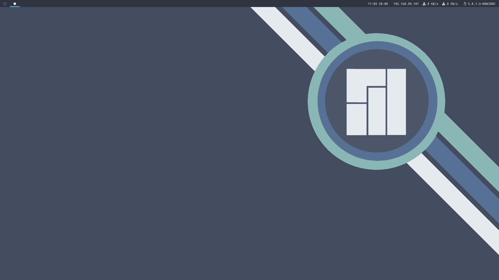
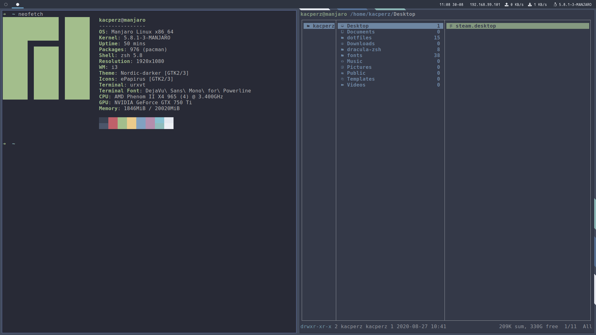

# i3 Dotfiles with [Nord Theme](https://www.nordtheme.com/)





[Wallpaper Photo by Creative Vix from Pexels](https://www.pexels.com/photo/forest-mountains-fog-clouds-9754/)
### Including
  - urxvt theme
  - .xresources [Nord Theme](https://www.nordtheme.com/) palette
  - Rofi theme

## Dependencies

- [Polybar](https://polybar.github.io/)
- [i3](https://i3wm.org/)
- [Oh My ZSH!](https://ohmyz.sh/)
- [Dracula for ZSH](https://github.com/dracula/zsh/tree/44e7b24cc9b102ccdbc2fab277dda5b103a5189c)

### Fonts
- DejaVu Sans Mono for Poweline
- Fantasque Sans Mono
- Iosevka

### Instalation
```sh
$ git clone git@gitlab.com:riviofficial/dotfiles.git
$ cd dotfiles
$ cp .bashrc ~/ && cp -r .config/polybar ~/.config/polybar && cp .i3 ~/ && cp .Xresources ~/ && cp .zshrc ~/ 
```

### TODO
 - customized polybar based on default theme

#### License

GNU GENERAL PUBLIC LICENSE  Version 3, 29 June 2007
